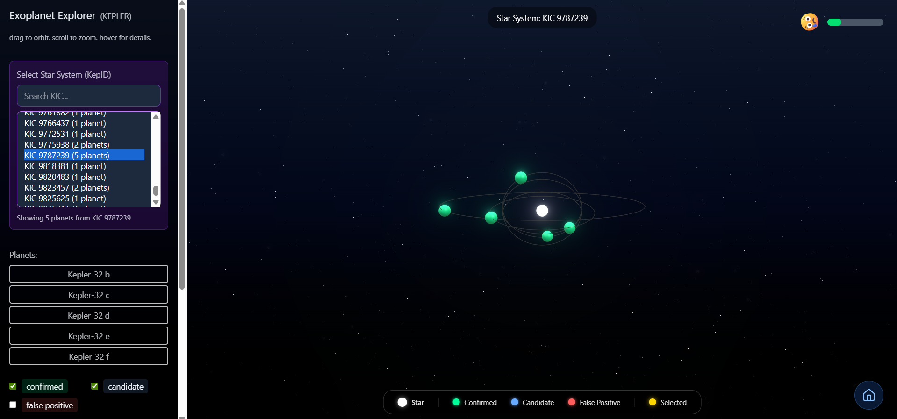

# Exoplanet Detection with AI

## Overview

This project leverages artificial intelligence and machine learning techniques to analyze NASA's open-source exoplanet datasets, aiming to accurately identify exoplanets. The model is trained on data from missions like Kepler, K2, and TESS, and is designed to classify new data into categories such as Confirmed Exoplanet, Known Planet, False Positive, Ambiguous Planet Candidate, or Planet Candidate.

## Challenge Statement

To create an AI/ML model that is trained on one or more of the open-source exoplanet datasets offered by NASA and that can analyze new data to accurately identify exoplanets.
[Challenge Link](https://www.spaceappschallenge.org/2025/challenges/a-world-away-hunting-for-exoplanets-with-ai/)

## Dataset

* **Kepler**: Transit photometry light curves with stellar and planetary parameters
* **K2**: Extended Kepler mission data with additional sky coverage
* **TESS**: All-sky transit survey data from NASA's Transiting Exoplanet Survey Satellite

**Classification Task**: Binary classification (Confirmed Exoplanet vs. False Positive)

**Features**: 28 engineered features including:
- Transit geometry (depth, duration, period)
- Stellar properties (temperature, radius, mass)
- Derived features (depth_anomaly, duration_fraction, signal_strength)

## Model Architecture
- **Algorithm**: LightGBM Gradient Boosting Classifier
- **Optimization**: Optuna hyperparameter tuning
- **Training**: 80/20 stratified train-test split
- **Class Handling**: Balanced class weights for imbalanced data

## Performance Metrics

### Overall Performance
| Metric    | Value  |
|-----------|--------|
| ROC AUC   | 95.81% |
| Accuracy  | 89.12% |
| Precision | 83.04% |
| Recall    | 90.91% |
| F1 Score  | 86.75% |

### Confusion Matrix Results
- **True Negatives (False Positives Identified)**: 1,078 (87.9%)
- **True Positives (Confirmed Planets Identified)**: 730 (90.91%)
- **False Negatives (Missed Real Planets)**: 73 (9.1%)
- **False Positives (False Alarms)**: 149 (12.1%)


*Confusion Matrix showing classification performance. The model correctly identifies 90.91% of confirmed exoplanets.*

## Model Evaluation Visualizations

### ROC Curve

*Receiver Operating Characteristic curve demonstrating excellent discriminative ability (AUC = 0.9581). The curve hugs the top-left corner, indicating strong performance across all classification thresholds.*

### Precision-Recall Curve

*Precision-Recall curve showing the trade-off between precision and recall. High area under curve (0.9258) indicates robust performance on imbalanced data.*

The model prioritizes physical consistency checks and transit geometry, which align with astrophysical principles for planet detection.


## Installation

1. Clone the repository:
```bash
git clone https://github.com/MahadSeecs/NasaSpaceAppsChallenge.git
```

2. Install dependencies:

```bash
pip install -r requirements.txt
npm install
```

## Usage

For frontend:
npm run dev inside exo-ui folder 

For backend
uvicorn app:app --reload inside backend folder

## Results

The model achieved an accuracy of [insert accuracy]% on the test dataset, with precision, recall, and F1 score values indicating a balanced performance across all classes.

## Conclusion

This project demonstrates the potential of AI/ML models in automating the detection of exoplanets from large astronomical datasets. Future work will focus on improving model generalization and exploring additional features to enhance classification




