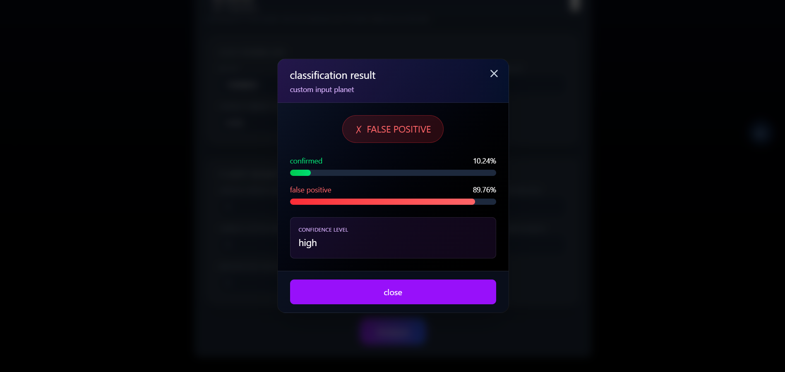

# Exoplanet Detection with AI

## Overview

This project leverages artificial intelligence and machine learning techniques to analyze NASA's open-source exoplanet datasets, aiming to accurately identify exoplanets. The model is trained on data from missions like Kepler, K2, and TESS, and is designed to classify new data into categories such as Confirmed Exoplanet, Known Planet, False Positive, Ambiguous Planet Candidate, or Planet Candidate.

## Challenge Statement

Your challenge is to create an AI/ML model that is trained on one or more of the open-source exoplanet datasets offered by NASA and that can analyze new data to accurately identify exoplanets.
[Challenge Link](https://www.spaceappschallenge.org/2025/challenges/a-world-away-hunting-for-exoplanets-with-ai/)

## Dataset

* **Kepler**: Light curve data with classifications like Confirmed Exoplanet and False Positive.
* **TESS**: Light curve data with classifications such as Known Planet, Ambiguous Planet Candidate, and Planet Candidate.


## Performance Metrics

| Metric               | Value    |
| -------------------- | -------- |
| Accuracy             | 0.8906   |
| Precision (Weighted) | 0.8946   |
| Recall (Weighted)    | 0.8906   |
| F1 Score (Weighted)  | 0.8914   |


## Installation

1. Clone the repository:


2. Install dependencies:

```bash
pip install -r requirements.txt
npm install
```

## Usage

For frontend:
npm run dev inside exo-ui folder 

For backend
uvicorn app:app --reload inside backend folder

## Results

The model achieved an accuracy of [insert accuracy]% on the test dataset, with precision, recall, and F1 score values indicating a balanced performance across all classes.

## Conclusion

This project demonstrates the potential of AI/ML models in automating the detection of exoplanets from large astronomical datasets. Future work will focus on improving model generalization and exploring additional features to enhance classification


